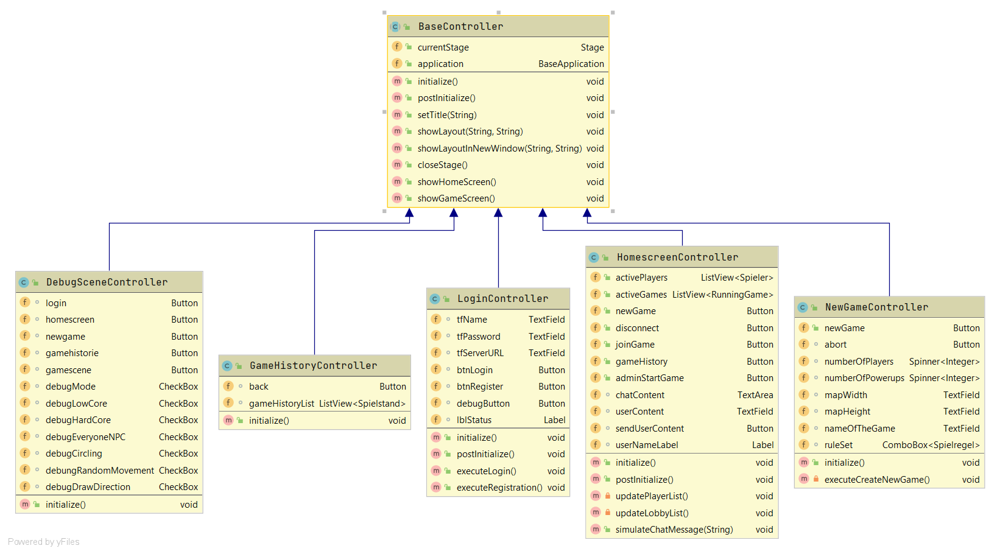
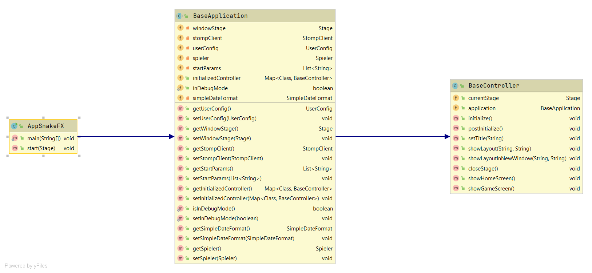

# SnakeFX & SnakeServer
Dies ist das Repository des Moduls Patterns und Frameworks im WiSe 2020.
Dieses Repository beinhaltet die Planungsdokumente, UML-Diagramme und den Quelltext des Projekts.

Das gesamte Projekt ist in der Programmiersprache Java entwickelt worden.
Alle Module des Projekts werden mit Java 8 - mittels Oracle's Java Development Kit kompiliert, getestet und ausgeführt.

Als Build-Management-System des Projekts kommt Apache Maven 3 zum Einsatz. Jedes Modul enthält eine pom.xml welche das jeweilige Project-Object-Model beschreibt.

## Modul-Struktur
**SnakeCore** \
Enthält die grundlegenden und gemeinsamen Aspekte des Projekts, wie beispielsweise Modelle welche in allen weiteren Projekten verwendet werden.

**SnakeFX** \
Das Frontend-Modul des Projekts - enthält das User-Interface der Anwendung.

**SnakeServer** \
Das Backend-Modul des Projekts - enthält den Applikations-Server der Anwendung.

**SnakeTest** \
Das Test-Projekt des Projekts - enthält Abhängigkeiten zu allen Sub-Modulen des Projekts
Enthält Test-Fälle für verschiedene Szenarien, z.B. um den Anwendungsserver und eine Menge von Clients zu initialisieren, miteinander zu verbinden, etc. - dient der Simulation von Echt-Welt-Interaktionen.

## Datei-Struktur
- docs - Enthält die Dokumentation zur Einrichtung und Nutzung des Projekts
- docs/Prototype - Enthält prototypische Dokumentationen zu ausgewählten Aspekten
- docs/UML - Enthält die UML-Diagramme zu verschiedenen Aspekten des Projekts
- workspace 
  - Enthält den Quelltext des Clients- als auch des Java-Backends
  - Enthält eine gemeinsame Projektbeschreibung (siehe /workspace/readme.md)

## API / Kommunikation
Die folgenden URLs werden vom Backend bereitgestellt und können von den Clients konsumiert und verarbeitet werden.

### WebSocket / STOMP
Die folgenden Befehle werden für den Datenaustausch verwendet:
- **connect** - Stellt eine Verbindung mittels StompClient auf einen HTTP-Handshake Endpoint her. Die dabei aufgebaute Session wird für den im folgenden beschriebenen Informationsaustausch verwendet.
- **subscribe** - Führt eine Subscription (dt. etwa "Anmeldung") auf ein bestimmtes Topic (dt. etwa "Thema") aus - der StompClient bspw. subscribed auf den "/topic/players"-Endpoint - im Anschluss werden alle Änderungen des Topics via Publish-Mechanismus an den Client übertragen und dort mittels Callbacks genutzt um das User-Interface zu aktualisieren. 
- **unsubscribe** - Führt eine Unsubscription (dt. etwa "Abmeldung") auf ein bestimmtes Topic aus.
- **send** - Sendet eine Nachricht in einem bestimmten Format an das Backend / den Server - die Nachrichten-Inhalte werden mittels Jackson im JSON-Format serialisiert und erzeugt, und auf der jeweiligen Endseite deserialisiert (Un/marshalling).

#### STOMP-Endpoints
Die folgenden URLs dienen als Adresse / Endpoints für die Kommunikation mittels WebSockets
- ws://localhost:13373/snakeserver - HTTP-Handshake und WebSocket / STOMP Upgrade
- ws://localhost:13373/app/games/{gameId} - Übertragung von Spielerdaten an das Backend - wird gebroadcastet an alle
  verbundenen Clients
- ws://localhost:13373/app/games/{gameId}/{playerId} - Bekanntgabe von Spielern aus der Lobby welche einem Spiel
  beitreten
- ws://localhost:13373/app/games/ - Veröffentlichung neuer Spiele
- ws://localhost:13373/app/players/ - Bekanntgabe des Beitritts von Spielern in die Lobby

#### HTTP / REST
Die folgenden URLs dienen als Adresse für die Kommunikation mittels HTTP-Protokoll
- http://localhost:13373/h2 (user: sa | pass: <none>)
- http://localhost:13373/api/spieler/
- http://localhost:13373/api/spieler/name
- http://localhost:13373/api/lobby
- http://localhost:13373/api/historie

## Architektur: Frontend
**BaseController** \
Das FrontEnd besitzt eine auf Vererbung basierende Controller-Hierarchie.
Jeder im Front-End verwendete Controller erbt von **BaseController** - einer abstrakten Oberklasse welche verschiedene Methoden besitzt und mittels Vererbung jedem ableitenden Controller zur Verfügung stellt.
Dazu zählen Beispielsweise:
- das Laden von Szenen (Scenes) mittels FXML-Datei (JavaFX Markup Language) in der selben Stage / Window. 
- verschiedene UI-bezogene Mechanismen wie das Dekorieren der Stage mittels Icon oder dem Aktualisieren des Stage-Titles, etc. 
- Eine Referenz auf die (JavaFX-)Application selbst welche im folgenden beschrieben wird.

   

**BaseApplication** \
JavaFX-Anwendung besitzen als kleinsten gemeinsamen Nenner eine Vererbung zur Application-Klasse - diese Klasse selbst kann jedoch auch eine 
abgeleitete Klasse von Application sein. Dieser Sachverhalt kann genutzt um einen einzelnen Bezugspunkt von logisch zusammenhängender Mechanismen zu bilden.

Aus diesem Grund wird im SnakeFX-Projekt die Ausgangsklasse von BaseApplication abgeleitet.
Diese Klasse besitzt, ähnlich wie die BaseController, verschiedene Mechanismen welche jedoch unabhängig vom User-Interface verwendet werden können.
Darunter fallen Beispielsweise:
- Eine Referenz auf den StompClient welcher genutzt werden kann um mittels WebSockets mit dem Backend zu kommunizieren.
- Der UserConfig welche die Anmelde- und Sessiondaten des aktuellen Users besitzt.
- uvw.

Mithilfe dieser Vererbungshierarchie ist es auf einfache Art und Weise möglich mittels Betätigung einer Schaltfläche (bspw. der Betätigung eines Buttons) einen HTTP- oder eine WebSocket-Message an das Backend zu initiieren, 
Operationen im selben Fenster auszuführen, etc. - und da jeder Controller von BaseController erbt und dieser eine Referenz auf die BaseApplication besitzt können auch verschiedene Aspekte des Frontends gesteuert und kontrolliert werden. 

  

## Architektur: Backend
Das Backend setzt auf verschiedene Module des Spring-Ökosystems:
- Spring Data JPA - zum Aufbau und Management des Persitence-Layers
- Spring Web - zur Bereitstellung von Web-Inhalten und REST-Services 
- Spring Security - zur Bereitstellung und Verwendung von Sicherheits-Mechanismen
- Spring Messaging - zur Bereitstellung und Kommunikation mittels WebSockets / STOMP

In Kombination mit Spring Data JPA wird die H2-Datenbank verwendet welche eine in der Programmiersprache Java entwickelte RDBMS darstellt - der Vorteil vom Einsatz von H2 ist unter anderem, dass keine Einrichtung (Installation, Konfiguration, Startup) für einen dedizierten Datenbank-Server durchgeführt werden muss - da der RDBMS beim Applikations automatisch gestartet wird - gerade bei kleineren Datenmengen trägt H2 nur wenige zusätzliche Millisekunden Bootup-Time zur Anwendung bei.  

Im Package **controller** existieren verschiedene Spring-Controller welche Endpunkte für RESTful Webservices/STOMP-Endpoints darstellen.

Im Package **persistance** existieren verschiedene Definitionen von Repository-Interfaces, welche, wie der Name vermuten lässt, für konkrete Implementierungen des Repository-Patterns genutzt werden - Spring Data generiert diese anhand von Interface-Definitionen selbstständig wodurch der Implementierungsaufwand für ORM-bezogene Tätigkeiten stark reduziert werden kann.

Im Package **runner** befinden sich verschiedene Ausprägungen von Spring-ApplicationRunnern welche bspw. genutzt werden um Initialisierungsaufgaben durchzuführen (z.B. Test-Daten in der Datenbank zu initialisieren).

Im Package **ws.server** befinden sich verschiedene Spring-Konfigurationsklassen welche zur Initialisierung von WebSockets und Security-Aspekten genutzt werden.

## Bugs / Offene Tasks
- Das Spielfeld muss mit der Spieldefinition und Config gekoppelt werden:
  - wenn im Frontend bspw. eine Map-Höhe von 16 und eine Map-Breite von 48 eingestellt wird muss das im Spiel
    wiedergegeben werden
- Liste von Spielen in Lobby wird (nicht immer) nicht korrekt dargestellt - trat irgendwo zwischen Commit 100 und Commit
  120 auf
- Spieler müssen einander das Ende des jeweils anderen abbeißen und "gut geschrieben" bekommen - [In progress] [TEST]
- Spieler tritt einem existierenden Spiel in der Lobby bei (Joining) [In Progress]
- Spieler verlässt Spiel während aktiver Spielrunde
  - Dieser Spieler sollte als Verlierer markiert werden
- Abschließende Integration der Design-Pattern
- Food / PowerUps generieren - Design Patterns anwenden [in progress]
- Konsum von Food an Backend übertragen -> nicht nur initiial! [in progress]
- Valide Endpoints für Spiele in der Lobby generieren und an RunningGames anhängen (aktuell immer "1", evtl. sowas wie
  eine UUID nehmen?)
- Bei Spielende
  - Unsubscribe von GameSessionMessages -> ansonsten empfängt man in einem weiteren Spiel alte Daten
  - Re-Subscribe nach erneuten beitreten eines Spiels
- Pro Spieler einen eigenen Highscore
- Nach Spiel:
  - unsubscribe des letzten game topics
- Präsentation ausarbeiten

## Post-Abgabe-Done

Diese Tasks wurden nach der Abgabe des Berichts erledigt.

- Auf SpielEnde / GameOver eines Clients reagieren [done]
  - Asynchrones GameOver - für jede Front-End Instanz eine eigene GameOver-Behandlung [done]
  - Sieger definieren [done]
  - Persistenz des aktuellen Spiels in die SpielHistorie [done]
  - switch zur Lobby zurück [done]
- Regeln des Spiels einhalten [done]
  - Aktuell existiert nur "Last Snake Standing" - Der letzte überlebende Spieler gewinnt [done]
- sout statements minimieren [done]
